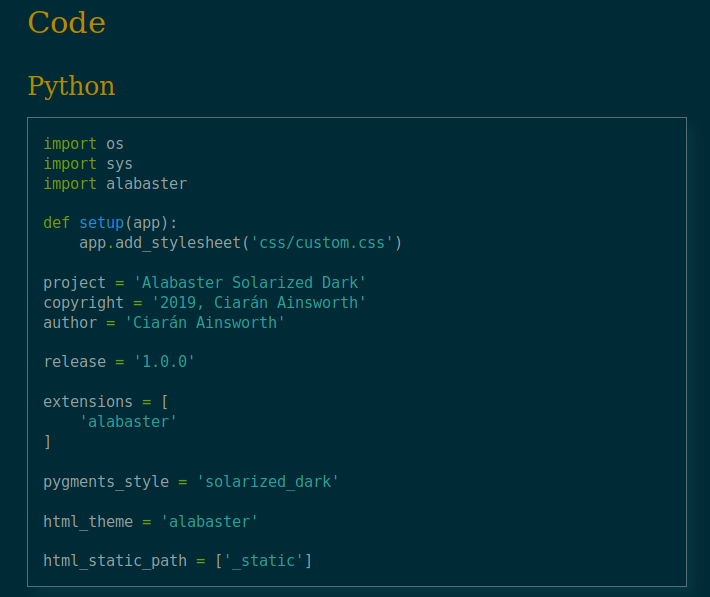

# Alabaster Solarised Dark Theme



## Custom CSS for Alabaster

This CSS is designed to customise [the Alabaster theme](https://alabaster.readthedocs./io/en/latest) for [Sphinx](https://sphinx-doc.org). It uses the [Solarized Dark](https://ethanschoonover.com/solarized) colour scheme for maximum comfort while reading.

This has been tested with Sphinx and [Ablog](https://ablog.readthedocs.io). An example of the theme in action can be seen [here](https://vigilant-hermann-bee4e2.netlify.com/)

## Special Features

* Full syntax highlighting in solarized-dark colours
* True solarized dark colour theme
* Colours for blocks such as `.. note::` and `.. warning::`

# Requirements

To get the most out of this theme, the following is recommended:

* [Pygments](https://pygments.org) for syntax highlighting
* [pygments-solarized](https://pypi.org/project/pygments-solarized) for syntax themeing
* [Alabaster](https://alabaster.readthedocs.io/en/latest)

# Installation

To set the theme up, place the `custom.css` file in a folder called `css` within your `html_static_path`
(usually `_static`) and add the following to your `conf.py`

```python

   # Tell the config file to look for a stylesheet in the css folder

   def setup(app):
    app.add_stylesheet('css/custom.css')

   # Tell Pygments to lex using the solarized dark theme

   pygments_style = 'solarized_dark'

   # Make sure your static path is set

   html_static_path = ['_static']
```

Now run `sphinx-build` or `ablog build` (depending on what you're using) and you should see the
CSS take effect.
